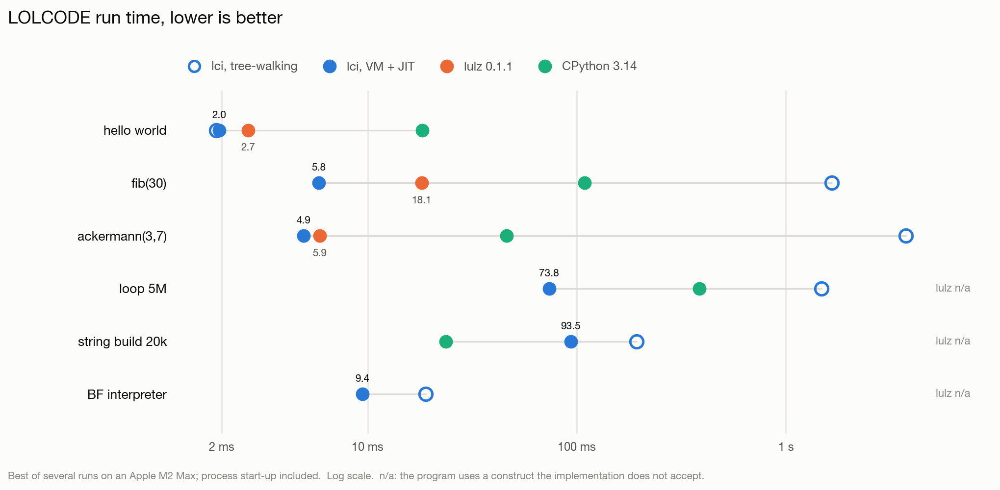

# lci - a LOLCODE interpreter written in C

NOTE:  For the latest LOLCODE language features, including a standard library (`CAN HAS STDIO?`), networking (`CAN HAS SOCKS?`), strings (`CAN HAS STRING?`), and more, please use the [`future`](https://github.com/justinmeza/lci/tree/future) branch (see an example at https://github.com/justinmeza/httpd.lol/blob/master/httpd.lol)!  The `main` branch is maintained for backwards compatibility with the LOLCODE 1.3 language specification (https://github.com/justinmeza/lolcode-spec/tree/master/v1.3
), but all future development should be done on the `future` branch.

## LICENSE

    Copyright (C) 2010-2014 Justin J. Meza

    This program is free software: you can redistribute it and/or modify
    it under the terms of the GNU General Public License as published by
    the Free Software Foundation, either version 3 of the License, or
    (at your option) any later version.

    This program is distributed in the hope that it will be useful,
    but WITHOUT ANY WARRANTY; without even the implied warranty of
    MERCHANTABILITY or FITNESS FOR A PARTICULAR PURPOSE.  See the
    GNU General Public License for more details.

    You should have received a copy of the GNU General Public License
    along with this program.  If not, see <http://www.gnu.org/licenses/>.

## ABOUT

lci is a LOLCODE interpreter written in C and is designed to be correct,
portable, fast, and precisely documented.

- correct: Every effort has been made to test lci's conformance to the
      LOLCODE language specification. Unit tests come packaged with the lci
      source code.
- portable: lci follows the widely ported ANSI C specification allowing it
      to compile on a broad range of systems.
- fast: Programs are compiled to bytecode and, where their types can be
      pinned down, on to machine code.  See PERFORMANCE, below.
- precisely documented: lci uses Doxygen to generate literate code
      documentation, browsable here.

This project's homepage is at http://lolcode.org.  For help, visit
http://groups.google.com/group/lci-general.  To report a bug, go to
http://github.com/justinmeza/lci/issues.

Created and maintained by Justin J. Meza <justin.meza@gmail.com>.

## PERFORMANCE

<picture>
  <source media="(prefers-color-scheme: dark)" srcset="assets/benchmarks-dark.png">
  
</picture>

Measured on an Apple M2 Max, best of several runs, process start-up included.
"Tree-walking" is lci as it was before the execution engine described below;
[lulz](https://github.com/MonliH/lulz) 0.1.1 compiles LOLCODE to Lua and runs it
on LuaJIT; the CPython column runs an equivalent Python program, as
[lulz's own benchmark](https://github.com/MonliH/lulz/tree/master/perfs) does.

| benchmark | lci, tree-walking | lci, VM + JIT | speed-up | lulz 0.1.1 | CPython 3.14 |
|---|--:|--:|--:|--:|--:|
| hello world | 1.9 ms | 2.0 ms | 1x | 2.7 ms | 18.2 ms |
| fib(30) | 1,653.6 ms | 5.8 ms | 283x | 18.1 ms | 109.1 ms |
| ackermann(3,7) | 3,743.7 ms | 4.9 ms | 758x | 5.9 ms | 46.2 ms |
| loop 5M | 1,475.3 ms | 73.8 ms | 20x | n/a | 385.3 ms |
| string build 20k | 193.6 ms | 93.5 ms | 2x | n/a | 23.6 ms |
| BF interpreter | 19.0 ms | 9.4 ms | 2x | n/a | n/a |

For scale, the same fib(30) written in C and compiled with `-O2` takes 5.0 ms on
this machine.  `n/a` means the implementation does not accept a construct the
program uses: lulz 0.1.1 does not implement `IM IN YR ... UPPIN YR` loops,
`SMOOSH`, or `SMALLR OF`/`BIGGR OF`.  String building is the one benchmark lci
loses: `SMOOSH` copies the whole string each time round the loop, where CPython
grows its buffer in place.

### How it runs a program

A program passes through as many of three stages as it can, and drops back a
stage whenever the next one cannot represent what it needs to do.  All three
share one set of semantics, one representation of values, and one kind of scope
object, so a procedure running in one stage can call a procedure running in
another.

1. **A tree-walking interpreter** (`interpreter.c`) still defines what every
   construct means, and still runs anything the other two stages decline.
2. **A register machine** (`vm.c`) compiles the parse tree into bytecode once,
   resolving names to registers or to scope slots ahead of time.  LOLCODE is
   dynamically scoped -- a function called with `I IZ` runs with its caller's
   scope as its parent -- so a whole-program analysis first works out which
   names no procedure ever reads from outside the one that declares them.  Only
   those become registers.
3. **A code generator** (`jit.c`) compiles a procedure to AArch64 or x86-64
   machine code when a dataflow pass can prove that every value it handles is an
   integer or a boolean.  Knowing the types statically means the generated code
   carries no tags, allocates nothing, and tests nothing at run time; the one
   check happens on entry, where a caller whose arguments do not match falls back
   to stage 2.  Targets other than those two run stages 1 and 2.

Deep recursion is reported rather than run into the ground: all three stages
check the remaining stack and stop with "Recursion too deep".

Three environment variables help when working on the engine:

| variable | effect |
|---|---|
| `LCI_NOJIT=1` | skip stage 3 and run everything on the register machine |
| `LCI_DUMP=1` | print each procedure's bytecode, and whether it reached stage 3 |
| `LCI_DUMP_ASM=<file>` | write the generated machine code out for a disassembler |

## PREREQUISITES

1. You must have CMake installed (www.cmake.org).
  a) If you're using a Linux distro with package managment CMake should be in
    your repositories.

2. Python 2.7+ or Python 2.x with the argparse module installed.

## INSTALLATION: THE EASY WAY ON LINUX OR MAC OSX

1. run the script install.py. Note that

  $ ./install.py -h

  will display a list of relevant install options. For
  example, if I wanted to install lci to the directory
  "/home/kurtis/opt" I would run:

  $ ./install.py --prefix="/home/kurtis/opt"

## INSTALLATION: THE MORE INVOLVED WAY ON LINUX OR MAC OSX

1. Configure lci using CMake. This can be as simple as opening up the terminal,
  navigating to the directory containing lci and typing:

  $ cmake .

  You can also provide any other argument to the CMake configuration process
  you'd like. To enable Memory testing turn the PERFORM_MEM_TESTS option on
  like so:

  $ cmake -DPERFORM_MEM_TESTS:BOOL=ON .

  You can also use the "ccmake" command or the CMake GUI if you prefer.
  See the cmake documentation for more details.

2. Build the project:

  $ make

3. Install

  $ make install

4. (Optional) Build documentation:

  $ make docs

5. (Optional) Run tests:

  $ ctest

## INSTALLATION ON WINDOWS

(Note that the instructions were written from the point of view of Windows 7,
but in practice, any modern version will work.)

1. Add MinGW and Python to your PATH.

  - Start > right-click Computer > Properties > Advanced system settings
    > Environment Variables....

  - Select the "PATH" variable and click "Edit...".

  - Add ";C:\MinGW\bin;C:\Python32" to the end.

3. Open an Administrator shell

  - Start > All Programs > Accessories > right-click Command Prompt
    > Run as administrator.

4. Navigate to the project directory using the "cd" command, for example,

  > cd C:\Users\%user%\Documents\lci

5. run the script install.py. Note that

  > install.py -h

  will display a list of relevant install options. For
  example, if I wanted to install lci to the directory
  "C:\Program Files\lci" I would run:

  > install.py --prefix="C:/Program Files/lci"

  (notice that forward slashes are used to separate directories.)
